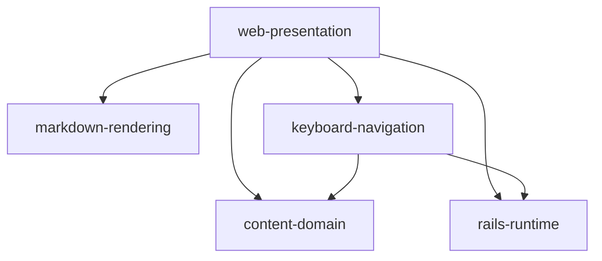

# Architecture Overview

> **Authoritative boundary record for this project.** Every source file under this project's **source root(s)** belongs to exactly one subsystem listed here. Every cross-subsystem import must follow the dependency graph below. Orphan files and undeclared imports block merge.

This document is maintained by:
- **planner** updates the subsystem list and dependency graph when a design introduces or rearranges boundaries.
- **builder** updates the catalog on every file add/move/delete in the same commit.
- **reviewer** verifies orphan-free state and graph fidelity at PR time.

---

## Source Roots

- `app/` — Rails application code (controllers, models, views, helpers, JS, assets, mailers, jobs, channels)
- `lib/` — application libraries (markdown renderer; Rails `lib/tasks` / `lib/assets` keepfiles)

> Tests live under `spec/` — the test directory is **not** a source root. Config, `db/`, `bin/`, `resume/`, and `terraform/` are also outside this catalog. Colocated JS unit tests (`app/javascript/**/*.test.js`) are test files too and are excluded from the catalog.

The orphan check is `git ls-files app lib | grep -v '\.test\.js$'`.

---

## Subsystems

1. **rails-runtime** — Shared Rails base controllers/jobs/mailers/cable and sitemap opt-out hooks. See [`sub-systems/rails-runtime.md`](./sub-systems/rails-runtime.md).
2. **content-domain** — ActiveRecord models for blog posts and projects (schema, validations, scopes, content file resolution). See [`sub-systems/content-domain.md`](./sub-systems/content-domain.md).
3. **markdown-rendering** — Redcarpet HTML renderer that applies Tailwind class styling to blog/project markdown. See [`sub-systems/markdown-rendering.md`](./sub-systems/markdown-rendering.md).
4. **web-presentation** — Controllers, views, helpers, Stimulus, Tailwind assets, and page chrome for the public site. See [`sub-systems/web-presentation.md`](./sub-systems/web-presentation.md).
5. **keyboard-navigation** — Modal (vim/neovim-style) keyboard navigation: `g`-prefix nav, `f` hint-jump, `:` command mode, `/` search mode, theme cycling, plus the JSON search-index endpoint. See [`sub-systems/keyboard-navigation.md`](./sub-systems/keyboard-navigation.md).

---

## Dependency Graph

**How to read this graph**: an edge `A --> B` means "subsystem A may import from subsystem B's public contract." The reverse direction is NOT permitted unless a reverse edge is also drawn.

**How to extend**:
- New subsystem? Add a node.
- New cross-subsystem import? Add an edge — but first justify it in the architect's plan.
- Cycles are bugs. The graph must remain a DAG.

---

## Source File Catalog (One-to-One Subsystem Mapping)

Every non-test file under `app/` and `lib/` appears here exactly once. Reviewers grep this list against `git ls-files app lib | grep -v '\.test\.js$'` to detect orphans. Catalog seed: **66** tracked source files (72 total `git ls-files app lib`, minus 6 colocated `*.test.js`).

### rails-runtime

- `app/controllers/application_controller.rb` — Base controller; production host URL options; class-level `noindex?`
- `lib/assets/.keep` — Rails lib/assets keepfile
- `lib/tasks/.keep` — Rails lib/tasks keepfile

### content-domain

- `app/models/application_record.rb` — ActiveRecord base; model-level `noindex?` for sitemap
- `app/models/post.rb` — Blog post metadata + markdown file content loader
- `app/models/project.rb` — Project portfolio record + optional markdown detail loader
- `app/models/concerns/.keep` — Concerns directory keepfile

### markdown-rendering

- `lib/blog/renderer.rb` — `Blog::Renderer` Redcarpet HTML renderer with header/paragraph/list Tailwind classes

### web-presentation

- `app/controllers/projects_controller.rb` — Projects index/show
- `app/controllers/welcome_controller.rb` — Landing + resume
- `app/controllers/writing_controller.rb` — Writing (Notes/Deep Dives) index/show
- `app/controllers/concerns/.keep` — Concerns directory keepfile
- `app/helpers/application_helper.rb` — Social icon helpers
- `app/helpers/blog_helper.rb` — `render_markdown` via `Blog::Renderer`
- `app/helpers/resume_helper.rb` — Resume YAML load + skill-level CSS
- `app/helpers/welcome_helper.rb` — Welcome helper module (empty)
- `app/javascript/application.js` — JS entry
- `app/javascript/controllers/application.js` — Stimulus application
- `app/javascript/controllers/collapse_controller.js` — Collapse toggle Stimulus controller
- `app/javascript/controllers/hello_controller.js` — Scaffold Stimulus controller
- `app/javascript/controllers/index.js` — Stimulus controller index
- `app/javascript/controllers/motion_controller.js` — Scroll fade/slide-in Stimulus controller (reduced-motion aware)
- `app/javascript/controllers/theme_picker_controller.js` — Theme switcher Stimulus controller (localStorage-persisted)
- `app/jobs/application_job.rb` — Base Active Job (scaffold)
- `app/mailers/application_mailer.rb` — Base mailer (scaffold)
- `app/channels/application_cable/channel.rb` — Action Cable channel base
- `app/channels/application_cable/connection.rb` — Action Cable connection base
- `app/assets/builds/.keep` — Built assets keepfile
- `app/assets/config/manifest.js` — Sprockets/jsbundling manifest
- `app/assets/images/.keep` — Images keepfile
- `app/assets/images/landing-image.webp` — Landing hero image
- `app/assets/stylesheets/application.tailwind.css` — Tailwind entry CSS + `@theme` tokens/DaisyUI theme source of truth
- `app/views/components/_card.html.erb` — Shared card partial (stretched-link wrapper, hover-lift)
- `app/views/components/_cta_button.html.erb` — Shared CTA button partial (primary/ghost)
- `app/views/components/_pill.html.erb` — Shared tag/status pill partial (status→badge-role map)
- `app/views/components/_section.html.erb` — Shared section wrapper partial (eyebrow/title + scroll motion)
- `app/views/layouts/application.html.erb` — Main HTML layout (meta-tags, analytics, FOUC-prevention theme script)
- `app/views/layouts/components/_header.html.erb` — Site header
- `app/views/layouts/components/_footer.html.erb` — Site footer
- `app/views/layouts/mailer.html.erb` — HTML mailer layout
- `app/views/layouts/mailer.text.erb` — Text mailer layout
- `app/views/projects/index.html.erb` — Projects listing
- `app/views/projects/index.rss.builder` — Projects RSS
- `app/views/projects/show.html.erb` — Project detail
- `app/views/welcome/index.html.erb` — Landing page
- `app/views/welcome/resume.html.erb` — Resume page shell
- `app/views/welcome/resume/_education.html.erb` — Resume education partial
- `app/views/welcome/resume/_header.html.erb` — Resume header partial
- `app/views/welcome/resume/_languages.html.erb` — Resume languages partial
- `app/views/welcome/resume/_main_summary.html.erb` — Resume summary partial
- `app/views/welcome/resume/_skills.html.erb` — Resume skills partial
- `app/views/welcome/resume/_work_experience.html.erb` — Resume work experience partial
- `app/views/writing/index.html.erb` — Writing listing (Notes/Deep Dives filter, editorial guidelines)
- `app/views/writing/index.rss.builder` — Writing RSS
- `app/views/writing/show.html.erb` — Writing post detail

### keyboard-navigation

- `app/controllers/search_index_controller.rb` — `GET /search-index.json`; title/description/tags-only serialization of published Posts + all Projects for SEARCH mode (never rendered-HTML body)
- `app/javascript/controllers/keyboard_nav_controller.js` — Stimulus controller wiring all modes; owns the only DOM/`getBoundingClientRect`/`.click` access and the `g`-prefix sequence buffer
- `app/javascript/keyboard_nav/commands.js` — COMMAND-mode (`:`) registry + parse/rank helpers; documented extension point for later metrics commands
- `app/javascript/keyboard_nav/resolve_nav_target.js` — pure `g`-prefix nav-target lookup via `data-nav-target`; injectable `root` for DOM-free unit tests
- `app/javascript/keyboard_nav/search_index.js` — SEARCH-mode (`/`) lazy fetch + module-scope tab-session cache and pure substring/title>tag>excerpt ranking
- `app/javascript/keyboard_nav/hints.js` — `f` hint-jump pure label-assignment logic (23-char alphabet, no DOM access)
- `app/javascript/keyboard_nav/theme_cycle.js` — single-source theme cycle order + pure `nextTheme` (mirrors the theme-picker `<select>` order)
- `app/views/layouts/components/_keyboard_command_bar.html.erb` — COMMAND (`:`) prompt chrome
- `app/views/layouts/components/_keyboard_guide_dialog.html.erb` — `?` help/guide dialog listing bindings and commands
- `app/views/layouts/components/_keyboard_hint_overlay.html.erb` — `f` hint-label overlay container
- `app/views/layouts/components/_keyboard_status_line.html.erb` — mode/status line indicator

---

## Ownership Counts

| Subsystem | File count |
|-----------|------------|
| rails-runtime | 3 |
| content-domain | 4 |
| markdown-rendering | 1 |
| web-presentation | 47 |
| keyboard-navigation | 11 |
| **Total** | **66** |

Must equal `git ls-files app lib | grep -v '\.test\.js$' | wc -l`.
