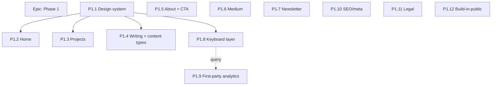

# Redesign — Phase 1 issue drafts

> Draft issues for **Phase 1** of the [2026 redesign](./redesign-2026.md) (visual refresh +
> content). Ready to create on GitHub once approved. Format mirrors the repo's existing
> issue template (Parent → Design → Context → ADLC delivers → Manual ops → Done when →
> Dependencies). All are `enhancement` unless noted.
>
> **Sequencing:** the design-system pass (P1.1) is the foundation and should merge first;
> it unblocks the page redesigns and the keyboard layer. Everything else is largely
> parallelizable. Suggested order: **P1.1 → (P1.2, P1.3, P1.4, P1.8 in parallel) →
> remainder**. Each issue is scoped to stay reviewable in one sitting.

---

## EPIC — 2026 Site Redesign — Phase 1: visual refresh + content

**Labels:** `enhancement`, `documentation`

### Context
Repurpose jamesebentier.com into a stronger, subtler launching point for fractional
architect/CTO work — nerdy but professional. Phase 1 delivers the brand impact: a
refined-terminal visual system, the page redesigns (home/projects/writing/about), the
Notes vs Deep Dives content model, Medium syndication, an aspirational newsletter, the
keyboard-driven command layer, first-party analytics (retiring GA/Metricool), SEO polish,
legal compliance, and build-in-public plumbing. Phase 2 (Bardic Labs identity/OIDC) is
tracked separately.

Design: `docs/design/redesign-2026.md`

### Children
- P1.1 Design system pass — theme tokens, Commit Mono, components, theme picker
- P1.2 Home / hero redesign
- P1.3 Projects page redesign
- P1.4 Writing redesign + Notes/Deep Dives content model
- P1.5 About page + "Work with me" contact CTA
- P1.6 Medium syndication (POSSE)
- P1.7 Newsletter signup (aspirational)
- P1.8 Keyboard command layer (site-as-terminal)
- P1.9 First-party analytics + retire GA/Metricool
- P1.10 SEO / meta / structured-data polish
- P1.11 Legal: Impressum + privacy policy
- P1.12 Build-in-public: /changelog + site version

### Done when
All twelve children are merged and the refreshed public site is live.

---

## P1.1 — Design system pass (refined-terminal visual foundation)

**Labels:** `enhancement`

### Parent
Epic: 2026 Site Redesign — Phase 1. Design: `docs/design/redesign-2026.md` §3.

### Context
Establish the "refined terminal, warmed up" visual language as reusable tokens +
components so every later page pulls from one source of truth. Dark-first, amber accent
(`#fab73a`), Commit Mono for headings/metadata/code + a clean sans for body, 18px base with
a Major-Third (1.250) scale. Includes the playful **terminal theme picker** (light/dark +
dev color schemes).

### ADLC delivers
- Tailwind `@theme` tokens: palette, type scale, font families (Commit Mono + sans).
- DaisyUI theme config for light, dark, and a curated set of developer schemes
  (candidates: Dracula, Solarized, Gruvbox, Nord, Tokyo Night, Catppuccin).
- Shared view components/partials: section wrapper, card, tag/status pill, CTA button.
- Theme-picker Stimulus controller with persisted choice (localStorage/cookie).
- A restrained motion controller (fade/slide, hover lift) respecting `prefers-reduced-motion`.

### Done when
- Tokens + components exist and are documented; the theme picker switches and persists.
- At least one existing page is migrated to the new components as a proof.
- Final bundled theme list and body-sans choice are recorded in the design doc.

### Dependencies
- **Blocks:** P1.2, P1.3, P1.4, P1.8.
- **Open detail:** final theme list, body sans pairing (design doc §8).

---

## P1.2 — Home / hero redesign

**Labels:** `enhancement`

### Parent
Epic: Phase 1. Design: `docs/design/redesign-2026.md` §2, §4.

### Context
Make the homepage the front door for *writing* (per the reference-site DNA): positioning +
one-line identity statement, featured projects, latest writing, and one understated CTA.

### ADLC delivers
- New hero with the positioning line: "I help engineers get their systems right — a
  fraction of the time, all of the leverage." (final hero copy drafted here).
- Featured projects + latest writing sections (driven by `featured` flags from P1.3/P1.4).
- Understated "Work with me" CTA (links to the mechanism from P1.5).

### Done when
- Home renders featured projects + latest posts using P1.1 components; CTA present; responsive.

### Dependencies
- **Blocked by:** P1.1. **Soft-depends:** P1.3/P1.4 for `featured` data (can stub first).

---

## P1.3 — Projects page redesign

**Labels:** `enhancement`

### Parent
Epic: Phase 1. Design: `docs/design/redesign-2026.md` §4, §5.

### Context
Replace the current list with a card grid, status pills, and the triple-link pattern
(read → demo → source) that signals "I ship."

### ADLC delivers
- `Project` additions: optional read/demo/source links + `featured` boolean (migration).
- Card-grid index with status pill (Pre-Launch/Beta/Live), filter by status, empty/coming-soon states.
- Updated project show page using P1.1 components.

### Done when
- Projects render as a filterable grid with triple-links + status; `featured` usable by home.

### Dependencies
- **Blocked by:** P1.1.

---

## P1.4 — Writing redesign + Notes/Deep Dives content model

**Labels:** `enhancement`

### Parent
Epic: Phase 1. Design: `docs/design/redesign-2026.md` §4, §5.

### Context
Introduce the two-kind content model (Notes vs Deep Dives), refresh the index + article
typography, and add tags/excerpt/reading-time. `/blog` becomes `/writing` (clean refresh,
no redirect). All existing posts backfilled as Deep Dives.

### ADLC delivers
- `Post` additions: `kind` enum (`note`|`deep_dive`), `excerpt`, `reading_time` (derived),
  `featured` boolean; surface `tags` (migration + backfill existing → `deep_dive`).
- `/writing` index with kind filter; article page typography polish; tags + excerpts + dates.
- Editorial guidelines page/section per design doc §5 (Note vs Deep Dive).

### Done when
- Posts have a kind; `/writing` filters by kind; articles show tags/excerpt/reading-time;
  existing content reads as Deep Dives.

### Dependencies
- **Blocked by:** P1.1.

---

## P1.5 — About page + "Work with me" contact CTA

**Labels:** `enhancement`

### Parent
Epic: Phase 1. Design: `docs/design/redesign-2026.md` §2, §4.

### Context
The `/about` page carries the soft fractional-architect + mentorship signal (proof over
pitch). The CTA starts as a simple `mailto:` link, structured to grow into a form/booking
flow later without a redesign.

### ADLC delivers
- `/about` narrative page (fractional architect + mentorship/community), using P1.1 components.
- "Work with me" CTA component wired to `mailto:` for now; placement on home + about + footer.

### Done when
- `/about` live; CTA renders and opens email; easy to swap the CTA target later.

### Dependencies
- **Blocked by:** P1.1.

---

## P1.6 — Medium syndication (POSSE)

**Labels:** `enhancement`, `documentation`

### Parent
Epic: Phase 1. Design: `docs/design/redesign-2026.md` §6.2.

### Context
Site is canonical; syndicate *to* Medium (their posting API is deprecated). Support an
"Also on Medium" link and document the manual import-with-canonical runbook.

### ADLC delivers
- `Post` additions: `medium_url` (+ optional `canonical_url`) (migration); render
  "Also on Medium" when present.
- `docs/ops/medium-syndication.md` runbook (publish here → Medium "Import a story" →
  canonical back to us → paste `medium_url`).

### Done when
- A post with `medium_url` shows the link; runbook exists and is followed once end-to-end.

### Manual ops
- Run the Medium import for a real post and confirm canonical points back to us.

### Dependencies
- **Soft-depends:** P1.4 (Post schema work) — coordinate migrations.

---

## P1.7 — Newsletter signup (aspirational, own-DB capture)

**Labels:** `enhancement`

### Parent
Epic: Phase 1. Design: `docs/design/redesign-2026.md` §5 (Newsletter).

### Context
A demand signal, not a launched newsletter. Capture addresses to our own DB (no provider
lock-in) with double opt-in and GDPR-compliant storage; if interest accumulates, stand up
sending later.

### ADLC delivers
- `Subscriber` model + double opt-in flow (confirm email), unsubscribe token.
- Signup form in footer + a tasteful home placement; success/confirmation states.
- GDPR-minded storage (consent timestamp, source); no third-party calls.

### Done when
- Visitors can subscribe + confirm; addresses stored with consent metadata; unsubscribe works.

### Dependencies
- **Related:** P1.11 (privacy policy must cover this). **Blocked by:** P1.1 (form styling).

---

## P1.8 — Keyboard command layer (site-as-terminal)

**Labels:** `enhancement`

### Parent
Epic: Phase 1. Design: `docs/design/redesign-2026.md` §3 (Signature interaction).

### Context
The personality centerpiece (inspired by commitmono.com): drive the whole site from the
keyboard. Command palette + single-key shortcuts + a keyboard-guide overlay, unifying
navigation and theme switching, and extensible so analytics queries (P1.9) can plug in.

### ADLC delivers
- Command palette overlay (`Cmd/Ctrl-K`, `` ` ``/`:`) — terminal-style input + command registry.
- Single-key shortcuts: `t` theme, `g h/w/p/l` nav, `/` search focus, `?` guide overlay, `Esc`.
- Keyboard-guide overlay; extensible command registry for future commands.
- **A11y:** no focus traps, screen-reader friendly, respects `prefers-reduced-motion`;
  full functionality without the layer (progressive enhancement).

### Done when
- Palette + shortcuts + guide work; nav and theme switch via keyboard; a11y checks pass;
  command registry documented for P1.9 to extend.

### Dependencies
- **Blocked by:** P1.1 (theme integration). **Feeds:** P1.9 (metrics query commands).

---

## P1.9 — First-party analytics + retire GA/Metricool

**Labels:** `enhancement`

### Parent
Epic: Phase 1. Design: `docs/design/redesign-2026.md` §6.5.

### Context
Framed as Bardic Labs' inaugural experiment: keep visitor data on our own infra. Remove
Google Analytics + Metricool; add lightweight, cookieless first-party event capture to
Postgres; expose read-only queries through the command layer.

### ADLC delivers
- Remove GA (`G-TWP4CV64DK`) + Metricool snippets from the layout.
- First-party event capture (page views, referrer, basic UTM) → Postgres; cookieless where
  possible; likely an `analytics` subsystem.
- Command-layer queries (`stats views --last 7d`, `top posts`, `referrers`) via P1.8.

### Done when
- GA/Metricool gone; views recorded first-party; at least one metric queryable in the terminal.

### Dependencies
- **Blocked by:** P1.8 (command layer). **Open detail:** public vs owner-only query scope (§8).

---

## P1.10 — SEO / meta / structured-data polish

**Labels:** `enhancement`

### Parent
Epic: Phase 1. Design: `docs/design/redesign-2026.md` §7 (item 8).

### Context
Improve discoverability/professionalism: per-page OG images and JSON-LD structured data.

### ADLC delivers
- Per-page Open Graph / Twitter images (or a templated generator).
- JSON-LD `Person` (site-wide) and `Article` (posts) structured data.
- Sanity pass on titles/descriptions/canonicals across pages.

### Done when
- Pages emit correct OG + JSON-LD; validates in a structured-data testing tool.

### Dependencies
- **Soft-depends:** P1.4 (article metadata).

---

## P1.11 — Legal: Impressum + privacy policy

**Labels:** `documentation`, `enhancement`

### Parent
Epic: Phase 1. Design: `docs/design/redesign-2026.md` §8 (Legal).

### Context
Berlin-based site: German law requires an **Impressum**; GDPR + TTDSG require a privacy
policy covering first-party analytics (P1.9) and the newsletter (P1.7). Dedicated ticket.

### ADLC delivers
- `/impressum` page (legally required disclosures).
- `/privacy` policy page covering first-party analytics, newsletter, cookies/localStorage.
- Footer links to both.

### Done when
- Both pages live and linked; content reviewed against current GDPR/TTDSG/Impressum needs.

### Manual ops
- Owner confirms the legal disclosures are accurate (consider professional review).

### Dependencies
- **Related:** P1.7, P1.9 (must be reflected in the policy).

---

## P1.12 — Build-in-public: /changelog + site version

**Labels:** `enhancement`, `documentation`

### Parent
Epic: Phase 1. Design: `docs/design/redesign-2026.md` §7 (item 12).

### Context
Document the refresh publicly: a `/changelog` page and a site version in the footer. The
companion "Rebuilding this site" **Notes series** is ongoing editorial (written via P1.4),
not part of this code issue.

### ADLC delivers
- `/changelog` page (sourced from markdown or a simple model).
- Site version shown in the footer.

### Done when
- `/changelog` renders and footer shows the current version.

### Dependencies
- **Soft-depends:** P1.4 (if changelog reuses the markdown pipeline).
